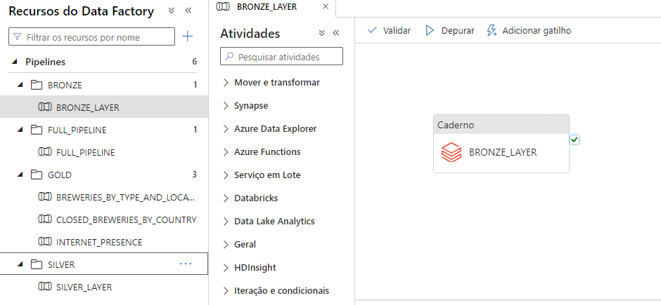

# Análise de Cervejarias no Azure Databricks

## Índice
1. [Objetivo do Projeto](#objetivo-do-projeto)
2. [Arquitetura Geral](#arquitetura-geral)
3. [CI/CD com GitHub Actions para Databricks](#cicd-com-github-actions-para-databricks)
   - [Visão Geral](#visão-geral)
   - [Fluxo de CI/CD](#fluxo-de-cicd)
     - [Integração com o GitHub](#1-integração-com-o-github)
     - [Detecção de Mudanças via Pull Request](#2-detecção-de-mudanças-via-pull-request-pr-na-branch-dev)
     - [Formatação com Black](#3-formatação-automática-com-black)
     - [Validação com Flake8](#4-validação-de-qualidade-de-código-com-flake8)
     - [Execução de Notebooks no Databricks](#5-execução-dos-notebooks-alterados-no-databricks)
     - [Acompanhamento via Workflows](#6-acompanhamento-de-execução-via-workflows-no-databricks)
4. [Uso do Azure Blob Storage no Pipeline](#uso-do-azure-blob-storage-no-pipeline)
   - [Formato Delta](#formato-delta)
   - [Partitionamento e Organização](#partitionamento-e-organização)
   - [Integração com Databricks](#integração-com-databricks)
5. [Orquestração com Azure Data Factory](#orquestração-com-azure-data-factory)
   - [Estrutura dos Pipelines](#estrutura-dos-pipelines)
   - [Controle de Atualização e Retry](#controle-de-atualização-e-retry)
6. [Processo ETL no Databricks](#processo-etl-no-databricks)
   - [Camada Bronze](#1-camada-bronze)
   - [Camada Silver](#2-camada-silver)
   - [Camada Gold](#3-camada-gold)
7. [Visualizações e Dashboards](#visualizações-e-dashboards)
   - [Painéis Criados](#painéis-criados)

---
## Objetivo do Projeto
O principal objetivo do projeto é construir um pipeline de dados eficiente e escalável para processar, transformar e analisar informações sobre cervejarias, contemplando:

- Integração e transformação de dados para facilitar a análise de cervejarias por país e província.
- Cálculo de métricas relevantes, como o percentual de cervejarias fechadas por região.
- Avaliação da presença online das cervejarias para identificar tendências de mercado digital.
- Construção de visualizações e dashboards interativos para simplificar a exploração dos dados e apoiar decisões baseadas em insights.

## Arquitetura Geral

A arquitetura do projeto é composta pelos seguintes componentes:

**Azure Databricks:** Utilizado para realizar as transformações de dados (ETLs) e para criar painéis de visualização interativos. Um cluster Spark é configurado para processar os dados de forma eficiente.

**GitHub Actions:** Gerencia o processo de CI/CD (Integração Contínua e Entrega Contínua) para manter o código atualizado e garantir a implantação automatizada dos notebooks e pipelines.

**Azure Data Lake (Blob Storage):** Armazena os dados em diferentes camadas (Bronze, Silver e Gold), permitindo o versionamento e a separação de dados brutos, processados e prontos para análise.

**Azure Data Factory:** Orquestra a execução dos notebooks no Databricks, garantindo a automação e o agendamento dos processos ETL.

**Azure Monitor:** Ferramenta para coleta de logs e métricas de execução, desempenho e falhas dos componentes da arquitetura, incluindo Data Factory, Databricks, e Blob Storage. Pode ser configurado com alertas e dashboards para monitorar o status do pipeline e qualidade dos dados em tempo real.

# CI/CD com GitHub Actions para Databricks

## Visão Geral
Este projeto utiliza o **GitHub Actions** para gerenciar o processo de CI/CD dos notebooks do **Azure Databricks**. O fluxo de trabalho garante que os notebooks sejam testados, validados e executados automaticamente sempre que houver alterações no repositório.

## Fluxo de CI/CD

### 1. Integração com o GitHub
O **Azure Databricks** está integrado ao repositório GitHub, permitindo versionamento e controle de código dos notebooks. Isso facilita o rastreamento de mudanças, revisões de código e colaborações entre desenvolvedores.

### 2. Detecção de Mudanças via Pull Request (PR) na Branch `dev`
Sempre que um **Pull Request (PR)** é criado ou atualizado na branch `dev`, o GitHub Actions é acionado para iniciar o processo de CI/CD.

- O fluxo detecta quais notebooks foram alterados no PR.

### 3. Formatação Automática com Black
Os notebooks Python são automaticamente formatados com o **Black** para garantir que o código segue um padrão consistente e legível.

- **Black** aplica padrões de estilo (PEP 8) para padronizar o layout do código.

### 4. Validação de Qualidade de Código com Flake8
Após a formatação, os notebooks passam por uma verificação de qualidade de código com o **Flake8**.

- **Flake8** verifica:
  - Estilo e formatação do código (conformidade com PEP 8).
  - Problemas de complexidade.
  - Possíveis bugs ou práticas de codificação incorretas.

### 5. Execução dos Notebooks Alterados no Databricks
Os notebooks que passaram pelas etapas de formatação e validação são executados como **jobs no Databricks**.

- A execução é feita diretamente via API do Databricks, iniciando jobs para cada notebook alterado.
- Isso garante que todas as mudanças de código sejam testadas na prática.

### 6. Acompanhamento de Execução via Workflows no Databricks
Os jobs do Databricks podem ser monitorados pela **interface de workflows**, onde é possível visualizar o status de execução:

- **Status dos Jobs**: Acompanhar se o job foi concluído com sucesso ou falhou.
- **Logs Detalhados**: Visualizar erros, exceções e tempo de execução.
  
Isso permite garantir que todas as alterações foram testadas antes de serem mescladas ou implantadas.

# Uso do Azure Blob Storage no Pipeline

O **Azure Blob Storage** atua como a principal camada de armazenamento para dados em diferentes etapas do pipeline (Bronze, Silver, Gold):

### Formato Delta
Os dados são armazenados no formato **Delta Lake** para oferecer transações seguras, controle de versão e melhor desempenho de leitura e escrita.

### Partitionamento e Organização
- **Partitionamento**: Dados particionados por `COUNTRY_NAME` e `STATE_PROVINCE` para otimizar consultas.
- **Estrutura de Caminhos**: Dados organizados em `/BRONZE/`, `/SILVER/` e `/GOLD/` para fácil gerenciamento e acesso.

### Integração com Databricks
- O Blob Storage serve como fonte e destino para leitura e escrita dos dados transformados em todas as camadas do pipeline de ETL.

# Orquestração com Azure Data Factory

A orquestração do pipeline de ETL foi feita utilizando o **Azure Data Factory**, permitindo o agendamento e execução automatizada dos processos de dados.

## Estrutura dos Pipelines

- **Pipelines por Camada**: 
  - Um pipeline separado foi criado para cada script de processamento (Bronze, Silver e Gold).
  - Esses pipelines refletem as camadas de dados e foram montados de forma independente.

- **Pipeline Principal (Sequencial)**:
  - Um pipeline mestre foi criado para rodar todos os pipelines de camada de forma sequencial.

  
## Controle de Atualização e Retry

- **Trigger Diário**: O pipeline sequencial é acionado diariamente para garantir a execução regular dos ETLs.
- **Estrutura de Retry**:
  - Implementada apenas na **camada Bronze**, que depende de dados provenientes de uma **API externa**.
  - O Retry foi adicionado para garantir a reexecução automática caso ocorra uma falha ao acessar a API.

> Nota: Não há informações sobre a frequência de atualização dos dados na fonte externa.

# Processo ETL no Databricks

## 1. Camada Bronze

### Objetivo
Armazenar dados brutos coletados de fontes externas (API) sem alterações, como uma "fonte da verdade".

### Detalhes do Processo
- **Ingestão**: Extração dos dados brutos de uma API externa, carregando-os em um DataFrame PySpark.
- **Controle de versão**: Adiciona colunas `DT_CREATED` e `DT_UPDATED`.
- **Armazenamento**: Dados são salvos no formato **Delta** no **Blob Storage** na pasta `BRONZE`, sem transformações ou limpeza.

---

## 2. Camada Silver

### Objetivo
Limpar, padronizar e transformar os dados da camada Bronze para facilitar análises e cálculos. Remove inconsistências e normaliza os dados para um formato padrão.

### Detalhes do Processo
- **Leitura e Sanitização**: Lê os dados brutos, Remove duplicatas com base no identificador principal (id), mantendo os registros mais recentes. e preenche campos críticos nulos com valores padrão.
- **Preenchimento de campos**: Preenche valores nulos em campos críticos (name, city, state, etc.) com valores padrão ("Unknown"). 
- **Normalização de Strings**: Padroniza campos de texto (capitalização e remoção de espaços).
- **Renomeação de Colunas**: Ajusta nomes de colunas para um formato padronizado (ex.: `name` → `BREWERY_NAME`).
- **Armazenamento**: Salva os dados transformados no **Blob Storage** na pasta `SILVER`, particionando por `COUNTRY_NAME` e `STATE_PROVINCE`.

---

## 3. Camada Gold

### Objetivo
Realizar agregações e cálculos finais para análises e visualizações.

### Detalhes do Processo
1. **Cervejarias por Tipo e Localização**:
   - Agrupa e conta cervejarias por `TYPE_OF_BREWERY`, `CITY_NAME`, `STATE_PROVINCE`, e `COUNTRY_NAME`.
2. **Cervejarias Fechadas por País e Província**:
   - Calcula o total e a porcentagem de cervejarias fechadas (`TYPE_OF_BREWERY == "Closed"`).
   - Usa `coalesce` para tratar nulos, preenchendo com zero.
3. **Presença Online por Tipo de Cervejaria**:
   - Analisa presença online (`WEBSITE` e `CONTACT_PHONE`) por tipo de cervejaria.
   - Calcula o percentual de presença online para cada tipo.

### Armazenamento
- Cada agregação é salva como uma tabela separada no **Blob Storage** na pasta `GOLD`, usando o formato Delta (ex.: `GOLD_BREWERIES_BY_TYPE_AND_LOCATION`).

---

# Visualizações e Dashboards
Os dashboards interativos foram criados no DataBricks a partir de consultas SQL executadas no Hive Metastore para explorar os dados de forma dinâmica e visual. Abaixo estão as visualizações desenvolvidas:

### Painéis Criados
1. **Painel 1: Quantidade de cervejarias por tipo e localização.**
   

2. **Painel 2: Porcentagem de cervejarias inativas por país**
   

3. **Painel 3: Análise de presença online por tipo de cervejaria**
   
